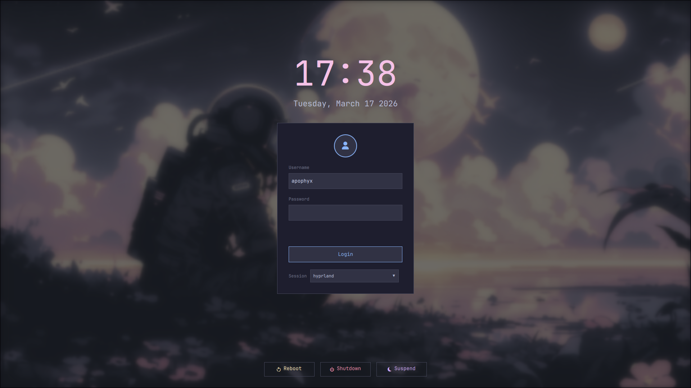

# Catppuccin Mocha SDDM Theme 🐱☕



A sleek, modern, and highly modular SDDM login theme featuring the authentic Catppuccin Mocha color palette. Built with a focus on simplicity, responsiveness, and aesthetic appeal.

## 🌟 Features

- **Catppuccin Mocha Palette**: A faithful implementation of the Mocha variant for a consistent and soothing aesthetic.
- **Modern UI**: Clean, centered card layout with smooth transitions and interactive feedback.
- **Dynamic Backgrounds**: Support for custom wallpapers with configurable Gaussian blur effects.
- **Power Management**: Integrated Reboot, Shutdown, and Suspend actions with intuitive Nerd Font iconography.
- **Responsive Design**: Adapts gracefully to various screen resolutions and multi-monitor setups.
- **Session Selector**: Robust session management compatible with both Wayland and X11 environments.

## 🛠️ Dependencies

This theme is designed for **SDDM 0.20.0 or newer (Qt6-based)**.

### Arch Linux
```bash
sudo pacman -S sddm qt6-declarative qt6-quickeffects qt6-svg ttf-jetbrains-mono-nerd
```

### Fedora
```bash
sudo dnf install sddm qt6-qtdeclarative qt6-qtquickeffects qt6-qtsvg jetbrains-mono-fonts
```

### Ubuntu/Debian (23.04+)
```bash
sudo apt install sddm qml6-module-qtquick qml6-module-qtquick-effects qml6-module-qtquick-controls qml6-module-qtquick-layouts qml6-module-qtsvg fonts-jetbrains-mono
```
*Note: A Nerd Font (e.g., JetBrainsMono Nerd Font) is **required** for icons to render correctly.*

## 🚀 Installation

### 1. Deploy the Theme
Clone or copy the directory to your system's SDDM theme folder:
```bash
sudo cp -r catppuccin-mocha-sddm-theme /usr/share/sddm/themes/
```

### 2. Set as Default
Enable the theme by creating an override configuration:
```bash
sudo mkdir -p /etc/sddm.conf.d
echo -e "[Theme]\nCurrent=catppuccin-mocha-sddm-theme" | sudo tee /etc/sddm.conf.d/10-theme.conf
```

### 3. Test (Optional)
You can preview the theme in a windowed environment before logging out:
```bash
sddm-greeter-qt6 --test-mode --theme /usr/share/sddm/themes/catppuccin-mocha-sddm-theme
```

## 🎨 Customization

All configuration is handled in the `theme.conf` file within the theme directory.

### Configuration Options

| Option | Description | Default |
|--------|-------------|---------|
| `background` | Path to the background image. | `../backgrounds/background.jpg` |
| `BlurRadius` | Intensity of the Gaussian blur (0-100). | `100` |
| `Font` | Font family for all text and icons. | `JetBrainsMono Nerd Font Mono` |
| `FontSize` | Global font size. | `13` |
| `ScreenWidth` | Forced screen width (0 for auto). | `1920` |
| `ScreenHeight` | Forced screen height (0 for auto). | `1080` |

### Changing the Background
1. Place your desired image in the `backgrounds/` folder or use an absolute path.
2. Update the `background` key in `theme.conf`:

   ```ini
   background=../backgrounds/my_wallpaper.png
   ```

### Adjusting Blur
The `BlurRadius` parameter controls the intensity of the background blur:
- **0**: Disables blur entirely for a sharp background.
- **50**: Provides a subtle "frosted glass" effect.
- **100**: Maximum blur for high contrast with the login card.

## 📂 Project Structure

- `Main.qml`: The entry point and primary layout logic.
- `components/`: Modular QML components (Clock, PowerButtons, etc.).
- `backgrounds/`: Default storage for wallpapers.
- `theme.conf`: User-facing configuration settings.
- `metadata.desktop`: SDDM theme metadata.

## 📄 License

This project is licensed under the MIT License.

---
*Inspired by the Catppuccin community. Built with ❤️ for the Linux desktop.*
